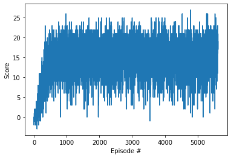

[//]: # (Image References)

[image1]: https://user-images.githubusercontent.com/10624937/42135619-d90f2f28-7d12-11e8-8823-82b970a54d7e.gif "Trained Agent"

# Project 1: Navigation


This repository contains an implementation of the DQN algorithm to solve the Banana Collector Unity ML-Agents environment.

## Project Overview

The goal of this project is to train an agent to navigate in the environment and collect maximum amount of bananas. The environment is provided by Unity's Banana Collector environment, where the agent receives a reward for collecting a yellow banana.

## Structure


- dqn_agent.py: Contains the implementation of the DQN agent, including the experience replay buffer, and the learning methods.
- model.py: Contains the implementation of the model, including the neural network architecture
- Navigation.ipynb: Contains the training code
- Navigation_test.ipynb: Contains the testing code

## Getting Started

### Prerequisites

- Python 3.6+
- PyTorch
- Unity ML-Agents
- Additional libraries as listed in `requirements.txt`

### Installation

1. Create (and activate) a new environment with Python 3.6.

	- __Linux__ or __Mac__: 
	```bash
	conda create --name drlnd python=3.6
	source activate drlnd
	```
	- __Windows__: 
	```bash
	conda create --name drlnd python=3.6 
	activate drlnd
	```
	

2. If running in **Windows**, ensure you have the "Build Tools for Visual Studio 2019" installed from this [site](https://visualstudio.microsoft.com/downloads/).  This [article](https://towardsdatascience.com/how-to-install-openai-gym-in-a-windows-environment-338969e24d30) may also be very helpful.  This was confirmed to work in Windows 10 Home.  

3. Follow the instructions in [this repository](https://github.com/openai/gym) to perform a minimal install of OpenAI gym.  
	- Next, install the **classic control** environment group by following the instructions [here](https://github.com/openai/gym#classic-control).
	- Then, install the **box2d** environment group by following the instructions [here](https://github.com/openai/gym#box2d).
	
4. Clone the repository (if you haven't already!), and navigate to the `python/` folder.  Then, install several dependencies.  
    ```bash
    git clone https://github.com/akocabas/deep-reinforcement-learning
    cd deep-reinforcement-learning/python
    pip install .
    ```

5. Create an [IPython kernel](http://ipython.readthedocs.io/en/stable/install/kernel_install.html) for the `drlnd` environment.    
    ```bash
    python -m ipykernel install --user --name drlnd --display-name "drlnd"
    ```

6. Before running code in a notebook, change the kernel to match the `drlnd` environment by using the drop-down `Kernel` menu. 


7. Go to p1_navigation folder:
    ```bash
    cd p1_navigation
    ```

8. Install the required dependencies:
    ```bash
    pip install -r requirements.txt
    ```

9. Download the environment from one of the links below.  You need only select the environment that matches your operating system:
    - Linux: [click here](https://s3-us-west-1.amazonaws.com/udacity-drlnd/P1/Banana/Banana_Linux.zip)
    - Mac OSX: [click here](https://s3-us-west-1.amazonaws.com/udacity-drlnd/P1/Banana/Banana.app.zip)
    - Windows (32-bit): [click here](https://s3-us-west-1.amazonaws.com/udacity-drlnd/P1/Banana/Banana_Windows_x86.zip)
    - Windows (64-bit): [click here](https://s3-us-west-1.amazonaws.com/udacity-drlnd/P1/Banana/Banana_Windows_x86_64.zip)

10. Place the file in the course GitHub repository, in the `p1_navigation/` folder, and unzip (or decompress) the file. 

### Instructions

Run Navigation.ipynb

Expected output:
        Episode 100	Average Score: 0.55
        Episode 200	Average Score: 2.87
        Episode 300	Average Score: 7.28
        Episode 400	Average Score: 10.79
        Episode 500	Average Score: 13.61
        ...
        Environment solved in 5527 episodes!	Average Score: 16.90




The model is saved in checkpoint.pth

The performance of the trained agent can be visualized by running test.ipynb notebook.


