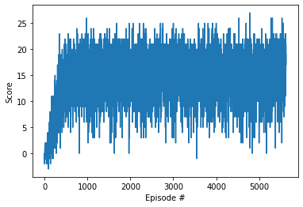

[//]: # (Image References)

[image1]: https://user-images.githubusercontent.com/10624937/42135619-d90f2f28-7d12-11e8-8823-82b970a54d7e.gif "Trained Agent"

# Project Report: DQN For Navigation

## Introduction

This report describes the implementation and results of a DQN agent applied to the Unity Banana Collector environment. The goal was to train an agent to navigate through the environement and collect the maximum amount of yellow bananas and the minimum amount of blue bananas.

### Algorithm Description

**Deep Q-Network (DQN)** is a reinforcement learning algorithm that integrates Q-learning with deep neural networks to approximate the optimal action-value function \( Q^*(s, a) \). This function is essential in deciding the best action to take in a given state by estimating the expected cumulative reward.

Key components of the DQN algorithm include:

1. **Action-Value Function Approximation**:
   - A neural network, referred to as the Q-network, is used to approximate the Q-values for each action given a state. This approach is crucial in environments with large state spaces where maintaining a Q-table is not feasible.

2. **Experience Replay**:
   - DQN stores the agent's experiences (state, action, reward, next state, done) in a replay buffer. Training on mini-batches sampled randomly from this buffer helps in stabilizing the learning process by breaking the correlation between consecutive samples.

3. **Fixed Q-Target**:
   - A separate target network, which is a copy of the Q-network, is used to compute the target values for the Q-learning update. The target network is updated less frequently than the Q-network, reducing the risk of divergence during training.

4. **Epsilon-Greedy Policy**:
   - The agent follows an epsilon-greedy policy to balance exploration and exploitation. With a probability \( \epsilon \), the agent selects a random action (exploration), and with a probability \( 1-\epsilon \), it selects the action that maximizes the Q-value (exploitation).

### Hyperparameters Used

- **n_episodes (int)**: 2,000,000  
  The maximum number of episodes the agent is allowed to interact with the environment. This ensures that the agent has enough time to explore the environment and learn the optimal policy.

- **max_t (int)**: 1,000  
  The maximum number of time steps per episode. This parameter defines how long the agent can interact with the environment in each episode.

- **eps_start (float)**: 1.0  
  The starting value of epsilon for the epsilon-greedy policy. Initially, the agent explores more by taking random actions.

- **eps_end (float)**: 0.01  
  The minimum value of epsilon. As training progresses, epsilon decreases, allowing the agent to exploit the learned policy more frequently.

- **eps_decay (float)**: 0.995  
  The decay rate for epsilon. After each episode, epsilon is multiplied by this factor, gradually reducing the exploration rate over time.

### Hyperparameters Tweaking

- **Epsilon Decay**: The decay rate was selected to ensure a proper balance between exploration and exploitation throughout training. By starting with a high epsilon and gradually decaying it, the agent has the opportunity to explore the environment sufficiently in the early stages of training.

- **Number of Episodes**: The large number of episodes (2,000,000) was set to ensure that the agent had ample opportunity to converge to an optimal policy. However, the algorithm includes an early stopping criterion where training is terminated if the environment is solved (achieving an average score of 16.9 over 100 consecutive episodes).

### Results

The training process logs the average score every 100 episodes. If the agent achieves an average score of 16.9 over 100 consecutive episodes, the environment is considered solved, and training is stopped. The trained model is then saved for future use.

Episode 5527	Average Score: 16.90

The trained agent can be visualized by running the `Navigation_test.ipynb` notebook.

### Conclusion

The DQN algorithm, with the specified hyperparameters, was successfully implemented in the Unity environment, enabling the agent to learn an optimal policy for navigation. The careful tweaking of hyperparameters, particularly the epsilon decay rate, was critical in balancing exploration and exploitation, contributing to the successful convergence of the agent's policy.

