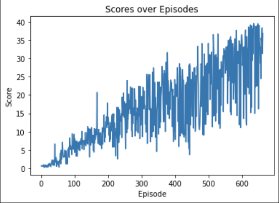

# Project Report: DDPG for Continuous Control

## Introduction

This report describes the implementation and results of a Deep Deterministic Policy Gradient (DDPG) agent applied to the Unity Reacher environment. The goal was to train an agent to control a robotic arm to keep its end-effector in a target location, achieving an average score of +30 over 100 consecutive episodes.

## Implementation Details

### Actor-Critic Architecture

- **Actor Network**: Maps states to actions. The network consists of two fully connected layers with ReLU activations. The output layer uses a tanh activation to ensure the action values are within the range [-1, 1].
  
- **Critic Network**: Estimates the Q-value for a given state-action pair. The network takes the state and action as inputs, processes them through two fully connected layers with ReLU activations, and outputs a single Q-value.

### Training Process

- **Replay Buffer**: Stores past experiences for training. A batch of experiences is sampled randomly from the buffer during each training step to break the correlation between consecutive experiences.
  
- **Noise Process**: An Ornstein-Uhlenbeck process is used to add noise to the actions during training, encouraging exploration.

- **Soft Updates**: The target networks (actor and critic) are updated slowly to stabilize learning using a soft update with a small factor `tau`.

### Hyperparameters

- **Actor Learning Rate**: 1e-4
- **Critic Learning Rate**: 1e-3
- **Replay Buffer Size**: 1e6
- **Batch Size**: 128
- **Gamma (Discount Factor)**: 0.99
- **Tau (Soft Update Factor)**: 1e-3
- **Noise Parameters**: `theta=0.15`, `sigma=0.2`

### Results

The agent was able to solve the environment, achieving an average score of +30 over 100 consecutive episodes. 

Environment solved in 562 episodes!	Average Score: 30.03

The trained agent can be visualized by running the `Continuous_Control_test.ipynb` notebook.

## Conclusion

This project successfully demonstrated the application of DDPG to a continuous control task. With careful tuning of hyperparameters and network architecture, the agent was able to learn an effective policy for keeping the robotic arm in the target location.

## Future Ideas

### 1. **Fine-Tuning Hyperparameters**
   - Implementing a learning rate scheduler that adjusts the learning rate dynamically based on the agent's performance

### 2. **Prioritized Experience Replay**
   - Implementing a prioritized experience replay buffer where more important experiences (based on their TD error) are sampled more frequently. This can help the agent learn more effectively from critical experiences.

### 3. **Implementing Dual Critic Networks (TD3)**
   - Incorporating ideas from Twin Delayed Deep Deterministic Policy Gradient (TD3), such as using two critic networks to address the overestimation bias in the Q-value predictions.

### 4. **Adjusting Noise Over Time**
   - Implementing a noise decay strategy where the exploration noise decreases over time, allowing the agent to focus more on exploitation as it becomes more confident in its policy.

## References

- Lillicrap, T.P., et al. (2015). Continuous Control with Deep Reinforcement Learning. [arXiv:1509.02971](https://arxiv.org/abs/1509.02971)
- OpenAI Spinning Up. DDPG: https://spinningup.openai.com/en/latest/algorithms/ddpg.html
