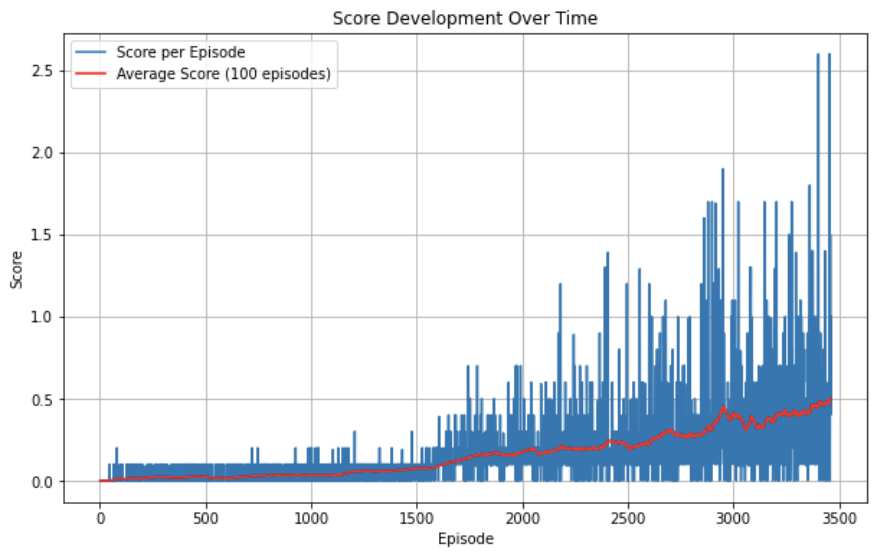

# Project Report: Multi-Agent Deep Deterministic Policy Gradient (MADDPG)

## Introduction

This project focuses on using the Multi-Agent Deep Deterministic Policy Gradient (MADDPG) algorithm to train two agents in the Unity ML-Agents Tennis environment. The primary goal is to enable the agents to keep a ball in play by hitting it over a net. 

## Problem Statement

In the Tennis environment, each agent controls a racket to hit a ball over a net. The task is considered solved when the agents achieve an average score of +0.5 over 100 consecutive episodes. The challenge lies in training the agents to learn optimal policies in a continuous action space using the MADDPG algorithm.

## Approach

### Algorithm: MADDPG

MADDPG is an extension of the Deep Deterministic Policy Gradient (DDPG) algorithm to multi-agent settings. Each agent has its own actor and critic networks, allowing them to learn policies in a competitive environment.

### Network Architectures

- **Actor Network**: The actor network outputs continuous actions based on the agent's observation. It consists of two hidden layers with ReLU activations followed by a Tanh activation in the output layer.
- **Critic Network**: The critic network evaluates the value of action-state pairs. It takes the agent's state and action as input and outputs a Q-value.

### Hyperparameters

- **Buffer Size**: 1e6
- **Batch Size**: 128
- **Learning Rate (Actor)**: 1e-4
- **Learning Rate (Critic)**: 1e-4
- **Discount Factor (Gamma)**: 0.99
- **Soft Update (Tau)**: 1e-3
- **Noise Parameters**: theta=0.15, sigma=0.2

## Training

Training was conducted over ca. 3500 episodes. During training, the agents' networks were updated based on experiences stored in a replay buffer. The training loop involved interaction with the environment, experience storage, and periodic network updates.

### Challenges Faced

- **Exploration vs. Exploitation**: Balancing exploration and exploitation was crucial. Adjusting the noise parameters helped improve exploration.
- **Learning Stability**: Training in a multi-agent environment can be unstable due to the non-stationary environment. This was mitigated by careful tuning of hyperparameters.

## Results

The agents successfully achieved an average score of 0.5 in ca. 3500 episodes, meeting the project’s success criteria. 

The trained agents can be visualized by running the `Tennis_test.ipynb` notebook. 

## Conclusion

The project demonstrated the effectiveness of the MADDPG algorithm in training agents in a multi-agent environment.

## Future Ideas

- Centralized Critic: Implementing a centralized critic that takes into account the joint actions and states of all agents. This can improve learning by providing a more global view of the environment

- Grid Search or Random Search: Systematically exploring different hyperparameter values for learning rates, batch sizes, discount factors, and other key parameters

- Attention Mechanisms: Integrating attention mechanisms to allow agents to focus on the most relevant parts of the state space.

## References

- Lowe, R., et al. "Multi-Agent Actor-Critic for Mixed Cooperative-Competitive Environments." Advances in Neural Information Processing Systems. 2017.
- OpenAI's DDPG algorithm.

